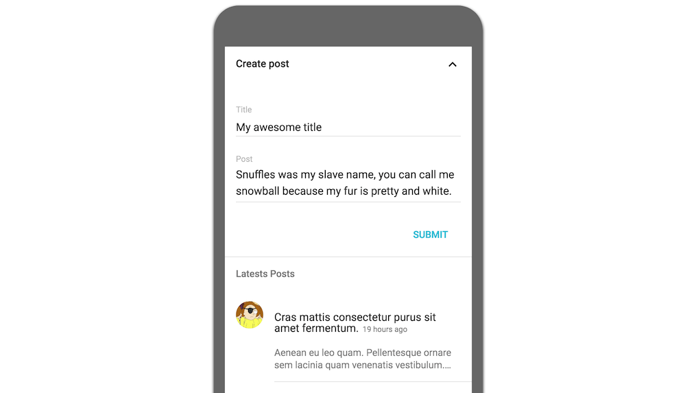

# React Universal example

A (fake) mobile blog/instant messaging mock application.

This is an example of how React can be used both in the client and the back-end. The front-end routes are shared between back and client with [React Router](https://reacttraining.com/react-router/), the `/api/*` routes are endpoints for the internal REST api and they are not shared.

You can create, update and remove posts.

All the visual content are made with [Material UI](https://github.com/callemall/material-ui) and the back with **Express** and **Mongoose**. 
